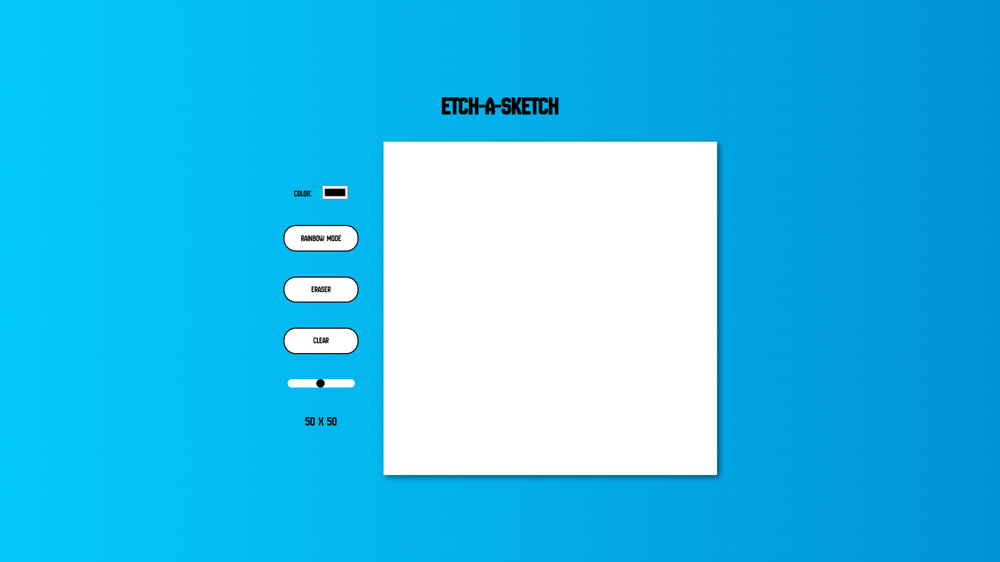

# Etch-a-Sketch
Welcome to the Etch-a-Sketch project! This is a web-based drawing application that mimics the classic Etch-a-Sketch toy.
You can draw on a grid, adjust the grid size, pick colors, use a rainbow mode, erase parts of your drawing, and clear the entire grid.

## Live Demo
You can try the live version of the project here: [Etch-a-Sketch](https://AnDel55/.github.io/etch-a-sketch/)

## Technologies Used
- HTML5: Structure of the application.
- CSS3: Styling and layout of the application.
- JavaScript (ES6+): Logic for grid creation, drawing, and event handling.